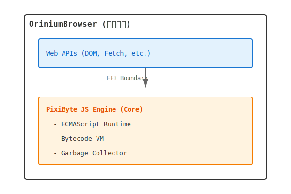

# PixiByte JavaScript Engine アーキテクチャ

### 設計原則
1. **明確な責任分離**: JSエンジンはECMAScript仕様の実装のみに集中し、ブラウザAPIには関与しない
2. **段階的な最適化**: 初期実装はシンプルさを優先し、バイトコードVM方式で開始。後にJITコンパイラを追加
3. **最新仕様のサポート**: ECMAScript最新仕様（ES2024+）を目標とした実装
4. **パフォーマンスと保守性のバランス**: 初期バージョンでは可読性と保守性を重視、段階的に最適化を導入
5. **安全性**: Rust言語の型安全性とメモリ安全性を活用
6. **WebAPIはOriniumBrowser側で実装**: DOM、Fetch API等のブラウザ固有機能はエンジン外で提供

### OriniumBrowserとの境界


## アーキテクチャ全体図


## 主要コンポーネント

### 1. Lexer (字句解析器)

**責任**: ソースコードを字句トークンの列に変換

**入力**: JavaScript ソースコード（文字列）
**出力**: トークン列 (`Token` stream)

**主要機能**:
- キーワード、識別子、リテラル、演算子の認識
- コメント、空白文字の処理
- 行番号、カラム位置の追跡（エラー報告用）
- Unicode対応

**実装方針**:
- 手書きレキサー（パフォーマンスと柔軟性のため）
- イテレータベースの設計で、遅延評価を活用

### 2. Parser (構文解析器)

**責任**: トークン列を抽象構文木（AST）に変換

**入力**: トークン列
**出力**: AST (`ast::Program`)

**主要機能**:
- 再帰下降パーサーによる構文解析
- ECMAScript文法の完全サポート（式、文、宣言、モジュール）
- 詳細なエラーメッセージとリカバリ
- ソースマップ情報の保持

**実装方針**:
- Pratt Parsing（演算子優先順位解析）
- エラーリカバリ機能（パースエラー後も続行可能）

### 3. AST (抽象構文木)

**責任**: プログラムの構造を階層的に表現

**主要ノードタイプ**:
- **式 (Expression)**: 識別子、リテラル、二項/単項演算、関数呼び出し、メンバーアクセス等
- **文 (Statement)**: 変数宣言、if/for/while、return、try-catch等
- **宣言 (Declaration)**: 関数宣言、クラス宣言、import/export

**実装方針**:
- `enum`ベースの代数的データ型
- スパン情報（行番号、カラム）をすべてのノードに付与
- ビジターパターンでトラバース可能

### 4. Bytecode Compiler (バイトコードコンパイラ)

**責任**: ASTをバイトコード命令列に変換

**入力**: AST
**出力**: バイトコードチャンク (`BytecodeChunk`)

**主要機能**:
- レジスタベースまたはスタックベースのバイトコード生成
- 定数プールの管理
- スコープ解析と変数バインディング
- 基本的な最適化（定数畳み込み、デッドコード除去）

**バイトコード命令セット例**:
```
LoadConst <reg> <const_idx>
LoadVar <reg> <var_idx>
StoreVar <var_idx> <reg>
Add <dst> <lhs> <rhs>
Call <func_reg> <args_count>
Jump <offset>
JumpIfFalse <cond_reg> <offset>
Return <reg>
```

**実装方針**:
- 初期はスタックベースVM（実装がシンプル）
- 将来的にレジスタベースに移行を検討
- デバッグ情報の保持

### 5. Bytecode VM (仮想マシン / インタープリタ)

**責任**: バイトコードを実行し、結果を生成

**主要機能**:
- バイトコード命令のディスパッチ
- スタック/レジスタ操作
- 関数呼び出しとリターン
- 例外処理
- クロージャのサポート

**実行モデル**:
```
VM State:
- Program Counter (PC)
- Call Stack
- Value Stack (or Registers)
- Global Environment
- Current Scope Chain
```

**実装方針**:
- スイッチディスパッチ（初期）
- 将来的にダイレクトスレッディングやJITに移行
- インライン化可能な命令ハンドラ

### 6. Value System (値表現)

**責任**: JavaScript値の内部表現

**JSValue型**:
```rust
enum JSValue {
    Undefined,
    Null,
    Boolean(bool),
    Number(f64),
    String(GcPtr<String>),
    Object(GcPtr<Object>),
    Symbol(GcPtr<Symbol>),
    BigInt(GcPtr<BigInt>),
}
```

**主要機能**:
- プリミティブ型とオブジェクト型の統一表現
- NaN-boxing または Pointer-tagging（最適化）
- 型変換（ToNumber, ToString, ToBoolean等）
- 等価性比較（===, ==）

**実装方針**:
- 初期はシンプルなenumベースの表現
- 後にNaN-boxingで64bit表現に最適化

### 7. Object System (オブジェクトシステム)

**責任**: JavaScriptオブジェクトの表現と操作

**主要機能**:
- プロパティストレージ（通常プロパティ、インデックスプロパティ）
- プロトタイプチェーン
- Hidden Classes（Shape/Map）による最適化
- プロパティディスクリプタ（enumerable, writable, configurable）
- Getter/Setter

**特殊オブジェクト**:
- 配列 (Array)
- 関数 (Function)
- 正規表現 (RegExp)
- Date, Map, Set, WeakMap, WeakSet
- Promise
- Proxy, Reflect

**実装方針**:
- 初期は単純なHashMapベースのプロパティストレージ
- 段階的にHidden Classesを導入

### 8. Runtime Environment (ランタイム環境)

**責任**: スコープと変数バインディングの管理

**主要機能**:
- グローバルオブジェクト
- レキシカルスコープチェーン
- 変数環境（var, let, const）
- クロージャのキャプチャ
- `this`バインディング

**実装方針**:
- Environment Record の実装
- スコープチェーンの最適化

### 9. Garbage Collector (ガベージコレクタ)

**責任**: 自動メモリ管理

**主要機能**:
- ヒープ上のオブジェクト管理
- 到達可能性分析
- 循環参照の処理
- WeakMap/WeakSetのサポート

**GC戦略**:
- **初期**: Mark-and-Sweep GC（シンプル）
- **将来**: 世代別GC（Generational GC）
- インクリメンタル/並行GC

**実装方針**:
- `GcPtr<T>` スマートポインタ型
- Write Barrierの実装
- Stop-the-World（初期）から段階的に並行化

### 10. Built-in Objects & Functions (組み込みオブジェクト)

**責任**: ECMAScript標準の組み込み機能

**主要オブジェクト**:
- グローバル関数: `parseInt`, `parseFloat`, `isNaN`, `eval` 等
- `Object`, `Array`, `Function`, `String`, `Number`, `Boolean`
- `Math`, `Date`, `RegExp`
- `Promise`, `Map`, `Set`, `WeakMap`, `WeakSet`
- `Proxy`, `Reflect`
- `Symbol`, `BigInt`
- イテレータ/ジェネレータ

**実装方針**:
- Rustネイティブ関数として実装
- 段階的に機能を追加（ES5 → ES2015+ → 最新仕様）

## データフロー

### 実行フロー

```
1. Source Code (String)
   ↓
2. Lexer::tokenize()
   ↓
3. Tokens (Vec<Token>)
   ↓
4. Parser::parse()
   ↓
5. AST (Program)
   ↓
6. Compiler::compile()
   ↓
7. Bytecode (BytecodeChunk)
   ↓
8. VM::execute()
   ↓
9. Result (JSValue)
```

### メモリ管理フロー

```
Object Creation → Heap Allocation → GC Tracking
                                          ↓
                                    Mark Phase
                                          ↓
                                    Sweep Phase
                                          ↓
                                    Memory Reclaim
```

## 実装ロードマップ

### Phase 1: 基礎実装（v0.1.0）

**目標**: 基本的なJavaScript実行環境

- [x] プロジェクトセットアップ
- [ ] Lexer: 基本トークン認識
- [ ] Parser: 式と基本的な文のパース
- [ ] AST定義
- [ ] バイトコード命令セット設計
- [ ] 単純なスタックベースVM
- [ ] 基本的な値表現（Number, String, Boolean, Undefined, Null）
- [ ] グローバルスコープ
- [ ] 基本的なGC（Mark-and-Sweep）

**サポート機能**:
- 変数宣言（`var`, `let`, `const`）
- 算術演算、論理演算
- if/else文
- while/forループ
- 関数宣言と呼び出し

### Phase 2: ECMAScript コア機能（v0.2.0）

- [ ] 完全なパーサー実装（全文法）
- [ ] オブジェクトとプロトタイプ
- [ ] 配列
- [ ] クロージャ
- [ ] `this`バインディング
- [ ] 例外処理（try-catch-finally）
- [ ] 正規表現
- [ ] 組み込みオブジェクト（Object, Array, String, Number等）

### Phase 3: 最適化と最新仕様（v0.3.0）

- [ ] Hidden Classes（Shape-based optimization）
- [ ] インライン化
- [ ] クラス構文（ES2015+）
- [ ] async/await
- [ ] Promise
- [ ] モジュールシステム（import/export）
- [ ] Symbol, BigInt
- [ ] Map, Set, WeakMap, WeakSet
- [ ] Proxy, Reflect

### Phase 4: JITコンパイラ（v1.0.0）

- [ ] JITコンパイラ設計
- [ ] ホットパス検出
- [ ] ベースラインJIT
- [ ] 最適化JIT
- [ ] デオプティマイゼーション
- [ ] インライン化、型推論

### Phase 5: 高度な最適化（v1.x）

- [ ] 世代別GC
- [ ] 並行/インクリメンタルGC
- [ ] SIMD最適化
- [ ] WebAssembly相互運用

## パフォーマンス目標

### ベンチマーク指標

- **Phase 1**: 正確性重視、パフォーマンスは問わない
- **Phase 2-3**: V8/SpiderMonkeyの10-20%程度の性能
- **Phase 4**: V8/SpiderMonkeyの50-70%程度の性能
- **Phase 5**: V8/SpiderMonkeyと同等の性能を目指す

### メモリ使用量

- 初期段階: 小規模スクリプトで < 10MB
- 最適化後: 効率的なメモリ利用（GCチューニング）

## テスト戦略

### テストスイート

1. **Unit Tests**: 各コンポーネント単位のテスト
2. **Integration Tests**: パイプライン全体のテスト
3. **ECMAScript Conformance Tests**: Test262準拠テスト
4. **Performance Benchmarks**: 各種ベンチマーク

### Test262準拠

ECMAScript仕様への準拠を確認するため、公式のTest262テストスイートを使用します。

## 外部ライブラリとの統合

### OriniumBrowserとのFFI境界

```rust
// OriniumBrowser側から呼び出される主要API
pub struct JSEngine {
    vm: VM,
    global: GlobalObject,
}

impl JSEngine {
    pub fn new() -> Self { ... }
    
    pub fn eval(&mut self, source: &str) -> Result<JSValue, JSError> { ... }
    
    pub fn call_function(&mut self, func: JSValue, args: &[JSValue]) 
        -> Result<JSValue, JSError> { ... }
    
    pub fn register_host_function(&mut self, name: &str, func: HostFunction) { ... }
    
    pub fn get_global(&self) -> &GlobalObject { ... }
}

// ホスト側（OriniumBrowser）が提供する関数
pub type HostFunction = fn(&[JSValue]) -> Result<JSValue, JSError>;
```

### 依存クレート候補

- **swc_ecma_parser** / **boa_parser**: パーサー参考実装
- **rustc-hash**: 高速ハッシュマップ
- **bumpalo**: アリーナアロケータ（GC用）
- **logos**: レキサー生成器（検討）
- **criterion**: ベンチマーク