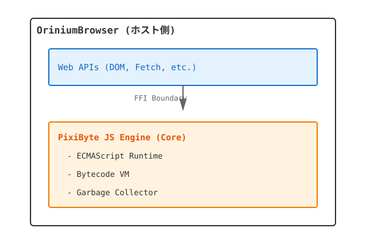
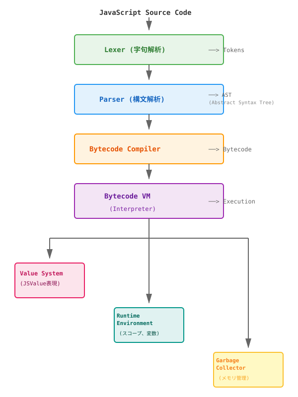

# PixiByte JavaScript Engine アーキテクチャ

### 設計原則
1. **明確な責任分離**: JSエンジンはECMAScript仕様の実装のみに集中し、ブラウザAPIには関与しない
2. **段階的な最適化**: 初期実装はシンプルさを優先し、バイトコードVM方式で開始。後にJITコンパイラを追加
3. **最新仕様のサポート**: ECMAScript最新仕様（ES2024+）を目標とした実装
4. **パフォーマンスと保守性のバランス**: 初期バージョンでは可読性と保守性を重視、段階的に最適化を導入
5. **安全性**: Rust言語の型安全性とメモリ安全性を活用
6. **WebAPIはOriniumBrowser側で実装**: DOM、Fetch API等のブラウザ固有機能はエンジン外で提供

### OriniumBrowserとの境界


## アーキテクチャ全体図


## 主要コンポーネント

### 1. Lexer (字句解析器)

**責任**: ソースコードを字句トークンの列に変換

**入力**: JavaScript ソースコード（文字列）
**出力**: トークン列 (`Token` stream)

**主要機能**:
- キーワード、識別子、リテラル、演算子の認識
- コメント、空白文字の処理
- 行番号、カラム位置の追跡（エラー報告用）
- Unicode対応

**実装方針**:
- 手書きレキサー（パフォーマンスと柔軟性のため）
- イテレータベースの設計で、遅延評価を活用

### 2. Parser (構文解析器)

**責任**: トークン列を抽象構文木（AST）に変換

**入力**: トークン列
**出力**: AST (`ast::Program`)

**主要機能**:
- 再帰下降パーサーによる構文解析
- ECMAScript文法の完全サポート（式、文、宣言、モジュール）
- 詳細なエラーメッセージとリカバリ
- ソースマップ情報の保持

**実装方針**:
- Pratt Parsing（演算子優先順位解析）
- エラーリカバリ機能（パースエラー後も続行可能）

### 3. AST (抽象構文木)

**責任**: プログラムの構造を階層的に表現

**主要ノードタイプ**:
- **式 (Expression)**: 識別子、リテラル、二項/単項演算、関数呼び出し、メンバーアクセス等
- **文 (Statement)**: 変数宣言、if/for/while、return、try-catch等
- **宣言 (Declaration)**: 関数宣言、クラス宣言、import/export

**実装方針**:
- `enum`ベースの代数的データ型
- スパン情報（行番号、カラム）をすべてのノードに付与
- ビジターパターンでトラバース可能

### 4. Bytecode Compiler (バイトコードコンパイラ)

**責任**: ASTをバイトコード命令列に変換

**入力**: AST
**出力**: バイトコードチャンク (`BytecodeChunk`)

**主要機能**:
- レジスタベースまたはスタックベースのバイトコード生成
- 定数プールの管理
- スコープ解析と変数バインディング
- 基本的な最適化（定数畳み込み、デッドコード除去）

**バイトコード命令セット例**:
```
LoadConst <reg> <const_idx>
LoadVar <reg> <var_idx>
StoreVar <var_idx> <reg>
Add <dst> <lhs> <rhs>
Call <func_reg> <args_count>
Jump <offset>
JumpIfFalse <cond_reg> <offset>
Return <reg>
```

**実装方針**:
- 初期はスタックベースVM（実装がシンプル）
- 将来的にレジスタベースに移行を検討
- デバッグ情報の保持

### 5. Bytecode VM (仮想マシン / インタープリタ)

**責任**: バイトコードを実行し、結果を生成

**主要機能**:
- バイトコード命令のディスパッチ
- スタック/レジスタ操作
- 関数呼び出しとリターン
- 例外処理
- クロージャのサポート

**実行モデル**:
```
VM State:
- Program Counter (PC)
- Call Stack
- Value Stack (or Registers)
- Global Environment
- Current Scope Chain
```

**実装方針**:
- スイッチディスパッチ（初期）
- 将来的にダイレクトスレッディングやJITに移行
- インライン化可能な命令ハンドラ

### 6. Value System (値表現)

**責任**: JavaScript値の内部表現

**JSValue型**:
```rust
enum JSValue {
    Undefined,
    Null,
    Boolean(bool),
    Number(f64),
    String(GcPtr<String>),
    Object(GcPtr<Object>),
    Symbol(GcPtr<Symbol>),
    BigInt(GcPtr<BigInt>),
}
```

**主要機能**:
- プリミティブ型とオブジェクト型の統一表現
- NaN-boxing または Pointer-tagging（最適化）
- 型変換（ToNumber, ToString, ToBoolean等）
- 等価性比較（===, ==）

**実装方針**:
- 初期はシンプルなenumベースの表現
- 後にNaN-boxingで64bit表現に最適化

### 7. Object System (オブジェクトシステム)

**責任**: JavaScriptオブジェクトの表現と操作

**主要機能**:
- プロパティストレージ（通常プロパティ、インデックスプロパティ）
- プロトタイプチェーン
- Hidden Classes（Shape/Map）による最適化
- プロパティディスクリプタ（enumerable, writable, configurable）
- Getter/Setter

**特殊オブジェクト**:
- 配列 (Array)
- 関数 (Function)
- 正規表現 (RegExp)
- Date, Map, Set, WeakMap, WeakSet
- Promise
- Proxy, Reflect

**実装方針**:
- 初期は単純なHashMapベースのプロパティストレージ
- 段階的にHidden Classesを導入

### 8. Runtime Environment (ランタイム環境)

**責任**: スコープと変数バインディングの管理

**主要機能**:
- グローバルオブジェクト
- レキシカルスコープチェーン
- 変数環境（var, let, const）
- クロージャのキャプチャ
- `this`バインディング

**実装方針**:
- Environment Record の実装
- スコープチェーンの最適化

### 9. Garbage Collector (ガベージコレクタ)

**責任**: 自動メモリ管理

**主要機能**:
- ヒープ上のオブジェクト管理
- 到達可能性分析
- 循環参照の処理
- WeakMap/WeakSetのサポート

**GC戦略**:
- **初期**: Mark-and-Sweep GC（シンプル）
- **将来**: 世代別GC（Generational GC）
- インクリメンタル/並行GC

**実装方針**:
- `GcPtr<T>` スマートポインタ型
- Write Barrierの実装
- Stop-the-World（初期）から段階的に並行化

### 10. Built-in Objects & Functions (組み込みオブジェクト)

**責任**: ECMAScript標準の組み込み機能

**主要オブジェクト**:
- グローバル関数: `parseInt`, `parseFloat`, `isNaN`, `eval` 等
- `Object`, `Array`, `Function`, `String`, `Number`, `Boolean`
- `Math`, `Date`, `RegExp`
- `Promise`, `Map`, `Set`, `WeakMap`, `WeakSet`
- `Proxy`, `Reflect`
- `Symbol`, `BigInt`
- イテレータ/ジェネレータ

**実装方針**:
- Rustネイティブ関数として実装
- 段階的に機能を追加（ES5 → ES2015+ → 最新仕様）

## データフロー

### 実行フロー

```
1. Source Code (String)
   ↓
2. Lexer::tokenize()
   ↓
3. Tokens (Vec<Token>)
   ↓
4. Parser::parse()
   ↓
5. AST (Program)
   ↓
6. Compiler::compile()
   ↓
7. Bytecode (BytecodeChunk)
   ↓
8. VM::execute()
   ↓
9. Result (JSValue)
```

### メモリ管理フロー

```
Object Creation → Heap Allocation → GC Tracking
                                          ↓
                                    Mark Phase
                                          ↓
                                    Sweep Phase
                                          ↓
                                    Memory Reclaim
```

## 実装ロードマップ

### Phase 1: 基礎実装

**目標**: 基本的なJavaScript実行環境

- [x] プロジェクトセットアップ
- [x] Lexer: 基本トークン認識
- [x] Parser: 式と基本的な文のパース
- [x] AST定義
- [x] バイトコード命令セット設計
- [x] 単純なスタックベースVM
- [x] 基本的な値表現（Number, String, Boolean, Undefined, Null）
- [x] グローバルスコープ
- [x] 基本的なGC（Mark-and-Sweep）

**サポート機能**:
- [x] 変数宣言（`var`, `let`, `const`）
- [x] 算術演算、論理演算
- [x] if/else文
- [x] while/forループ
- [x] 関数宣言と呼び出し

### Phase 2: ECMAScript コア機能

**目標**: JavaScriptの基本的なオブジェクト指向機能とクロージャのサポート
#### 2.1 オブジェクトシステム基礎
- [x] オブジェクト型の実装（`JSObject`）
- [x] プロパティアクセス（`get`/`set` の基本）
- [x] プロトタイプチェーンの基礎（`prototype` フィールドと継承の探索）
- [x] `Object.create()` / `Object.getPrototypeOf()` のグローバルAPI（builtins） (実装済み: ネイティブ関数として登録され、VM 経由で呼び出し可能) — 実装日: 2026-01-24, テスト: `tests/object_tests.rs`, `tests/object_accessor_tests.rs`
- [x] プロパティディスクリプタ（基本構造 `Property` と `define_property`）
- [x] `hasOwnProperty` 相当の機能（`has_own_property`） (実装済み: `Object.prototype.hasOwnProperty` をネイティブ関数として追加)
- [x] `Object.create` の第2引数（プロパティディスクリプタ）の最小サポートを実装（value/writable/enumerable/configurable）
- [x] `Object.prototype.isPrototypeOf` を実装（ネイティブ関数）
- [x] `Object.prototype.toString` を実装（ネイティブ関数、簡易版）
- [x] `Object.prototype.__proto__` アクセサ（getter/setter）を実装し、`Object.prototype` にアクセサとして登録
- [x] `Object.defineProperty` と `Object.getOwnPropertyDescriptor` をネイティブ関数として実装・登録
- [ ] `in` 演算子のパーサ/VM サポート

#### 2.2 配列
- [x] 配列の基本実装（`JSArray`）
- [x] インデックスアクセス `arr[0]`（基本構造）
- [x] `length` プロパティ同期（基本）
- [x] 配列メソッド:
  - [x] `push`, `pop`, `shift`, `unshift`
  - [ ] `slice`, `splice`
  - [ ] `map`, `filter`, `reduce`
  - [ ] `forEach`, `find`, `findIndex`
  - [ ] `join`, `concat`
  - [ ] `indexOf`, `includes`
- [x] 配列リテラル構文 `[1, 2, 3]`

#### 2.3 関数とクロージャ
- [x] 関数オブジェクト（`JSValue::Function` を含む基本表現）
- [x] 関数スコープとレキシカルスコープ（`Environment` の基礎実装）
- [x] クロージャの基礎（関数が生成時の環境を保持する仕組みの素地）
  - 注: 現在、関数定義と呼び出し、基本的なクロージャ動作は実装されていますが、名前付き関数式や一部の capture ルールの精査・改善が残っています。
- [ ] 即座実行関数式（IIFE）
- [ ] アロー関数 `() => {}`
- [ ] 可変長引数（`arguments` オブジェクト）
- [ ] デフォルト引数
- [ ] レストパラメータ `...args`

#### 2.4 `this` バインディング
- [ ] 呼び出し時の `this` バインディング（関数呼び出し / メソッド呼び出し）
- [ ] `call`, `apply`, `bind` の組み込み

- [x] `call`, `apply` の組み込み（ネイティブ関数として実装し、VM 経由で JS バイトコード関数を呼べるように対応）
- [ ] `bind` の実装（未対応）

#### 2.5 例外処理
- [ ] `try-catch-finally` 文のパースとVMサポート
- [ ] `throw` 文
- [ ] Error オブジェクトとスタックトレース（基礎）

#### 2.6 組み込みオブジェクト
- [ ] `Object` グローバルオブジェクト（各種 util を含む）
- [ ] `Array` コンストラクタ（標準的挙動の完全実装）
  - [x] `Array.prototype.push`, `Array.prototype.pop` の最小ネイティブ実装を追加（builtins/array.rs）
- [ ] `String` オブジェクトとメソッド（主要メソッドは未実装）
- [ ] `Number` オブジェクトとメソッド

#### 2.7 パーサー拡張
- [x] オブジェクトリテラル `{ key: value }`
- [x] メンバーアクセス `obj.prop`, `obj[prop]`
- [x] 配列リテラル `[1, 2, 3]`
- [ ] メソッド定義構文（`obj = { method() {} }` 等）
- [ ] 配列/オブジェクト分割代入
- [ ] スプレッド構文 `...`
- [ ] テンプレートリテラル `` `hello ${name}` ``

#### 2.8 コンパイラ拡張
- [x] オブジェクト作成命令
- [x] プロパティアクセス命令
- [x] 配列作成命令
- [x] 関数定義命令（`CreateFunction` / `CallFunction` の基礎実装）
  - 注: `CreateFunction` と `CallFunction` による関数生成・呼び出しは動作します。クロージャキャプチャの完全統合や名前付き関数式の取り扱いの微調整は継続中です。
- [ ] クロージャキャプチャ最適化（環境の軽量化）
- [ ] 例外ハンドリング命令

**補足（現状まとめ）**:
- リポジトリ内では `src/value/jsobject.rs`, `src/value/jsarray.rs`, `src/value/jsvalue.rs`, `src/parser/mod.rs` などが既に実装されており、オブジェクト・配列・関数の基礎が整っています。
- テストはプロジェクト方針どおり `tests/` 配下に配置されており、主要なユニット／統合テストは現状で成功している状態です。
- 次の優先作業は `this` バインディング（呼び出し時の振る舞い）、例外処理、そして builtins（`Object.create` 等）の実装です。

### Phase2 進捗更新と優先度付き実行計画
以下は Phase2（ECMAScript コア機能）について、現在の進捗と今後の優先実装計画です。

概要: Phase1 は完了済みのため、Phase2 は ECMAScript のコア機能（オブジェクトモデル、`this` セマンティクス、プロパティ記述子、型変換など）を中心に実装します。短期（1週間）で高優先度を安定させ、中期（1か月）で中/低優先度を完了する計画です。

#### 優先度: 高
- 作業A: プロパティ記述子の完全実装と `Object.defineProperty` / `Object.getOwnPropertyDescriptor` のサポート
  - 目的: データ/アクセサ記述子（value/writable/get/set/configurable/enumerable）を仕様どおり扱う
  - 見積: 中（4-16h）
  - 主要修正候補ファイル: `builtins/object.rs`, `src/value/jsobject.rs`, `vm/mod.rs`, `gc/mod.rs`
  - テスト（追加予定、`tests/` 配下）: `tests/object_descriptor_tests.rs` — `define_property_data_descriptor`, `define_property_accessor_descriptor`, `get_own_property_descriptor_matches_define`, `define_non_configurable_delete_fails`

- 作業B: アクセサ（getter/setter）の実装と呼び出し時の `this` ハンドリング
  - 目的: アクセサが正しい `this` を受け取り、副作用・戻り値が反映される
  - 見積: 中（4-16h）
  - 主要修正候補ファイル: `builtins/object.rs`, `builtins/function.rs`, `src/value/jsobject.rs`, `vm/mod.rs`, `runtime/mod.rs`
  - テスト: `tests/object_accessor_tests.rs` — `getter_receives_this`, `setter_updates_internal_state`, `accessor_descriptor_enumeration`

- 作業C: `this` バインディング規則の実装（通常呼び出し / メソッド呼び出し / construct / call/apply/bind）
  - 目的: strict と non-strict を含めた ECMAScript の呼び出しセマンティクスの整合
  - 見積: 大（>16h）
  - 主要修正候補ファイル: `builtins/function.rs`, `vm/mod.rs`, `compiler/mod.rs`, `runtime/mod.rs`
  - テスト: `tests/function_this_tests.rs` — `plain_call_non_strict_this_global`, `method_call_this_object`, `construct_new_this`, `call_apply_bind_behavior`

#### 優先度: 中
- 作業D: `delete` 演算子と `configurable` の扱い、`Object.preventExtensions` / `Object.freeze` / `Object.seal`
  - 見積: 中（4-16h）
  - 主要ファイル候補: `src/vm/mod.rs`, `src/value/jsobject.rs`, `builtins/object.rs`
  - テスト: `tests/object_mutation_tests.rs` — `delete_non_configurable_fails`, `prevent_extensions_prevents_add`, `freeze_prevents_write`

- 作業E: `instanceof` / `isPrototypeOf` / `Object.getPrototypeOf` とプロトタイプチェーン整合性
  - 見積: 小〜中（状況次第）
  - 主要ファイル候補: `builtins/object.rs`, `src/value/jsobject.rs`, `vm/mod.rs`
  - テスト: `tests/prototype_tests.rs` — `instanceof_with_function_prototype`, `is_prototype_of_true_false`, `getPrototypeOf_returns_correct_proto`

- 作業F: ToPrimitive / ToString / ToNumber の基本的な型変換ルール実装
  - 見積: 中（4-16h）
  - 主要ファイル候補: `src/value/jsvalue.rs`, `src/value/jsobject.rs`, `runtime/mod.rs`
  - テスト: `tests/conversion_tests.rs` — `to_primitive_object_with_valueOf`, `to_string_number_conversion`, `addition_uses_to_primitive`

#### 優先度: 低
- 作業G: `Object.prototype.toString`, `hasOwnProperty`, `propertyIsEnumerable` 等ヘルパ関数の整備
  - 見積: 小（<4h）
  - 主要ファイル候補: `builtins/object.rs`, `src/value/jsvalue.rs`
  - テスト: `tests/object_proto_helpers_tests.rs` — `toString_tag_object_array`, `hasOwnProperty_true_false`, `propertyIsEnumerable_behaviour`

- 作業H: 配列・オブジェクト列挙順、`for..in` と `Object.keys` 等の仕様準拠
  - 見積: 中（4-16h）
  - 主要ファイル候補: `builtins/array.rs`, `builtins/object.rs`, `src/value/jsarray.rs`, `src/value/jsobject.rs`
  - テスト: `tests/enumeration_tests.rs` — `for_in_enumeration_order`, `object_keys_excludes_non_enumerable`, `getOwnPropertyNames_includes_non_enumerable`

- 作業I: `Function.prototype.bind` の完全実装（部分適用と `new` の相互作用）
  - 見積: 中（4-16h）
  - 主要ファイル候補: `builtins/function.rs`, `vm/mod.rs`, `compiler/mod.rs`
  - テスト: `tests/function_bind_tests.rs` — `bind_preserves_this_and_args`, `bound_function_new_behavior`, `bound_length_name_handling`

#### マイルストーン
- 短期（1週間）: 高優先度項目（A〜C）の実装着手と主要ユニットテスト追加。`tests/` に高優先度テスト群を追加し、ローカルでパスする状態を目指す。
- 中期（1か月）: 中/低優先度（D〜I）を実装完了。全 `tests/` が通ることと、GC/VM に絡む回帰バグの修正。

#### リスク / 注意点
- GC とプロパティ/関数のライフサイクルの整合性: アクセサや関数がオブジェクトに保存される場合の参照管理に注意。
- `this` バインディングの落とし穴: strict と non-strict の違い、`call`/`apply`/`bind`、`new` の処理順に注意。
- 既存挙動の破壊回避: プロパティ属性のデフォルトや生成時の挙動を変えると回帰を招くため段階的に適用する。
- テストポリシー: すべての追加テストは `tests/` 配下に作成すること（既存のプロジェクト方針に合致）。

> このセクションは Plan エージェント（自動生成）に基づく計画の反映です。今後、各作業を実装完了したら該当チェックボックスをこのドキュメントに付けていきます。

## パフォーマンス目標

### ベンチマーク指標

- **Phase 1**: 正確性重視、パフォーマンスは問わない
- **Phase 2-3**: V8/SpiderMonkeyの10-20%程度の性能
- **Phase 4**: V8/SpiderMonkeyの50-70%程度の性能
- **Phase 5**: V8/SpiderMonkeyと同等の性能を目指す

### メモリ使用量

- 初期段階: 小規模スクリプトで < 10MB
- 最適化後: 効率的なメモリ利用（GCチューニング）

## テスト戦略

### テストスイート

1. **Unit Tests**: 各コンポーネント単位のテスト
2. **Integration Tests**: パイプライン全体のテスト
3. **ECMAScript Conformance Tests**: Test262準拠テスト
4. **Performance Benchmarks**: 各種ベンチマーク

### テストの配置ポリシー
- すべてのテストはリポジトリルートの `tests/` ディレクトリに配置します。
  - `src/` 内の `#[cfg(test)]` やモジュール内テストは許容しません（例外的に非常に局所的で短命なテストを置く場合のみチーム合意の上で可）。

### Test262準拠

ECMAScript仕様への準拠を確認するため、公式のTest262テストスイートを使用します。

## 外部ライブラリとの統合

### OriniumBrowserとのFFI境界

```rust
// OriniumBrowser側から呼び出される主要API
pub struct JSEngine {
    vm: VM,
    global: GlobalObject,
}

impl JSEngine {
    pub fn new() -> Self { ... }
    
    pub fn eval(&mut self, source: &str) -> Result<JSValue, JSError> { ... }
    
    pub fn call_function(&mut self, func: JSValue, args: &[JSValue]) 
        -> Result<JSValue, JSError> { ... }
    
    pub fn register_host_function(&mut self, name: &str, func: HostFunction) { ... }
    
    pub fn get_global(&self) -> &GlobalObject { ... }
}

// ホスト側（OriniumBrowser）が提供する関数
pub type HostFunction = fn(&[JSValue]) -> Result<JSValue, JSError>;
```

### 依存クレート候補

- **swc_ecma_parser** / **boa_parser**: パーサー参考実装
- **rustc-hash**: 高速ハッシュマップ
- **bumpalo**: アリーナアロケータ（GC用）
- **logos**: レキサー生成器（検討）
- **criterion**: ベンチマーク

